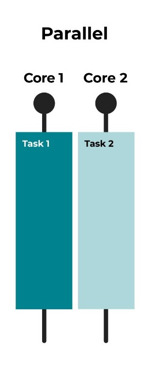
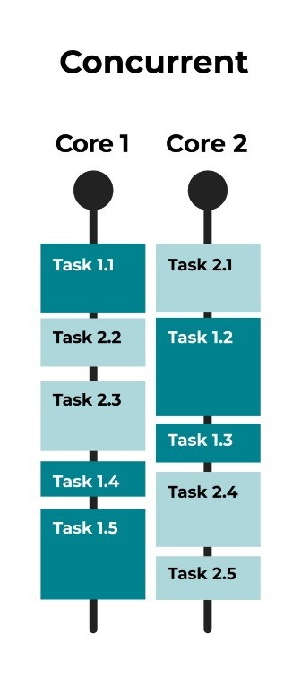

### NAMA : Sapta Adzani Purnama
### NRP : 3123521014
### Prodi : D3 Teknik Informatika-LA
### KELAS : A

# perbedaan serial, konkuren, paralel, dan konkuren paralel

## Parallel

### Deskripsi: Dua tugas (Task 1 dan Task 2) dijalankan secara bersamaan pada dua core yang berbeda.
### Penjelasan: Setiap core menjalankan tugas yang berbeda pada waktu yang sama. Ini menunjukkan paralelisme, di mana Task 1 dijalankan sepenuhnya di Core 1, dan Task 2 dijalankan sepenuhnya di Core 2 tanpa ada pembagian waktu antar tugas.
### Keuntungan: Memaksimalkan penggunaan CPU, efisien untuk tugas-tugas yang dapat dipecah menjadi subtugas yang dapat berjalan secara independen.

## concurrent

### Deskripsi: Beberapa bagian dari tugas (Task 1.1, Task 1.2, Task 1.3, dll.) dijalankan bergantian pada dua core.
### Penjelasan: Setiap core beralih antara beberapa bagian tugas kecil, memungkinkan beberapa tugas untuk membuat kemajuan selama periode waktu tertentu. Ini menunjukkan konkruensi, di mana kedua core secara bergantian mengerjakan bagian-bagian dari beberapa tugas.
### Keuntungan: Memungkinkan sistem untuk tetap responsif, bahkan jika beberapa tugas memerlukan waktu lama untuk selesai. Cocok untuk aplikasi yang perlu menangani banyak tugas yang berpotensi memblokir.

## parallel and concurent

### Deskripsi: Bagian-bagian dari beberapa tugas (Task 1.1, Task 2.1, Task 1.2, Task 2.2, dll.) dijalankan secara bersamaan dan bergantian pada dua core.
### Penjelasan: Menggabungkan kedua pendekatan di atas, di mana tugas-tugas dibagi menjadi bagian-bagian kecil dan dijalankan baik secara bersamaan di dua core yang berbeda dan bergantian di dalam core tersebut. Ini adalah skenario paling efisien di mana paralelisme dan konkruensi dimanfaatkan secara penuh.
### Keuntungan: Menggabungkan keunggulan paralelisme dan konkruensi, memastikan penggunaan CPU yang optimal sambil menjaga responsivitas sistem.

