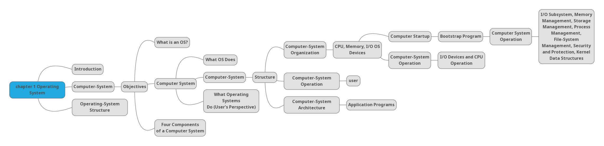
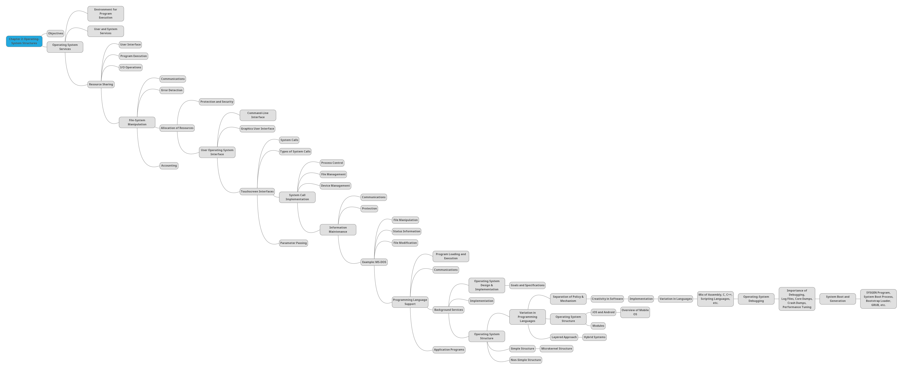

### NAMA : Sapta Adzani Purnama
### NRP : 3123521014
### Prodi : D3 Teknik Informatika-LA
### KELAS : A
# Chapter 1: Introduction

## Introduction
- Objectives
- Overview of Operating System Structures

## Operating System Services
  - User Operating System Interface
    - Command-Line Interface (CLI)
      - Bourne Shell Command Interpreter
    - Graphical User Interface (GUI)
      - Touchscreen Interfaces
      - Examples: Mac OS X GUI
  - System Calls
    - Definition and Purpose
    - Example of System Calls
    - System Call Implementation
    - System Call Parameter Passing
  - Types of System Calls
    - Process Control
    - File Management
    - Device Management
    - Information Maintenance
    - Communications
    - Protection
  - Examples of System Calls in Windows and Unix
  - Standard C Library Example
    - Program invoking printf() and write() calls
  - System Programs
    - File Manipulation
    - Status Information
    - Programming Language Support
    - Program Loading and Execution
    - Communications
    - Background Services
    - Application Programs

## Operating System Design and Implementation
  - Design Goals and Specifications
  - Separation of Policy and Mechanism
  - Implementation Details and Languages

## Operating System Structure
  - Simple Structure (MS-DOS)
  - Non-Simple Structure (UNIX)
  - Layered Approach
  - Microkernel System Structure
  - Hybrid Systems
  - Modules

## Operating System Debugging and Performance Tuning
  - Debugging Principles
  - Performance Tuning and Tools
  - DTrace and Performance Monitoring

## Operating System Generation and System Boot
  - System Generation with SYSGEN
  - System Boot Process

# Chapter 2: Operating-System Structures

## Objectives
- Describe the services an operating system provides
- Discuss ways of structuring an operating system
- Explain how operating systems are installed, customized, and booted

## Operating System Services
- Provide environment for program execution and services to users
- User Interface (CLI, GUI, Batch)
- Program execution, I/O operations, file-system manipulation, communications, error detection

## User Operating System Interface
- **CLI**
  - Direct command entry
  - Implemented in kernel or as system program
  - Fetches and executes commands
- **GUI**
  - User-friendly desktop metaphor
  - Icons, mouse, keyboard
  - Examples: Windows, Mac OS X, Unix/Linux with GUI

## System Calls
- Programming interface to OS services
- Written in high-level language (C, C++)
- Accessed by programs through APIs
- Examples: Win32 API, POSIX API, Java API

## System Call Implementation
- Number associated with each system call
- Interface maintains a table
- Invokes system call in OS kernel
- Parameters passed using registers, memory block, or stack

## Types of System Calls
- Process control, file management, device management, information maintenance, communications, protection

## Example: MS-DOS
- Single-tasking
- Shell invoked at boot
- No process creation
- Single memory space
- Program exit reloads shell

## System Programs
- Convenient environment for program development
- File manipulation, status information, file modification, programming language support, program loading and execution, communications, background services, application programs

## Operating System Design and Implementation
- Design goals and specifications
- Separate policy from mechanism
- Creative task of software engineering

## Implementation
- Early OSes in assembly, now often in C, C++, scripting languages
- Mix of languages for different components

## Operating System Structure
- Simple structure (MS-DOS)
- Complex structure (UNIX)
- Layered approach
- Microkernel (e.g., Mach)
- Modules (loadable kernel modules)
- Hybrid systems

## iOS and Android
- iOS: Based on Mac OS X, Cocoa Touch, Objective-C API
- Android: Based on Linux kernel, Dalvik VM, Java-based apps

## Operating-System Debugging
- Debugging is finding and fixing errors
- Log files, core dumps, crash dumps
- Performance tuning, profiling
- Tools like DTrace for live instrumentation

## System Generation and Boot
- SYSGEN for system-specific configuration
- Bootstrap loader in ROM or EEPROM
- GRUB for selecting kernel
- System loads and starts execution

 