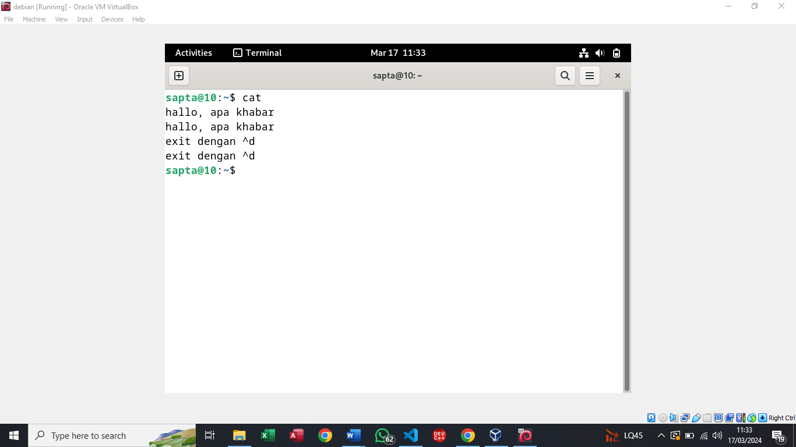

### NAMA : Sapta Adzani Purnama
### NRP : 3123521014
### Prodi : D3 Teknik Informatika-LA
### KELAS : A

# TUGAS PENDAHULUAN:
### Redirection
Redirection adalah proses dalam sistem operasi Unix/Linux yang memungkinkan Anda untuk mengalihkan output dari suatu perintah ke lokasi lain, seperti menyimpannya dalam file atau menggunakan output sebagai input untuk perintah lainnya. Ada beberapa jenis redirection, termasuk redirect output (`>`), yang mengalihkan output dari suatu perintah ke file, redirect input (`<`) yang menggunakan file sebagai input untuk perintah, dan pipes (`|`) yang mengalihkan output dari satu perintah ke input dari perintah lainnya.

### Pipeline
Pipeline adalah serangkaian perintah yang dijalankan bersama-sama di shell Unix/Linux, di mana output dari satu perintah menjadi input untuk perintah berikutnya. Pipeline dibuat dengan menggunakan operator pipa (`|`). Contoh: `command1 | command2 | command3`.

### Perintah-perintah:
- **echo**: Perintah ini digunakan untuk menampilkan teks atau nilai variabel ke terminal.
- **cat**: Singkatan dari "concatenate", perintah ini digunakan untuk menggabungkan dan menampilkan isi satu atau beberapa file teks ke terminal.
- **more**: Perintah ini digunakan untuk menampilkan isi file teks satu halaman pada satu waktu di terminal, dengan kemungkinan untuk melompat ke halaman berikutnya atau sebelumnya.
- **sort**: Perintah ini digunakan untuk mengurutkan baris-baris dalam file teks berdasarkan kriteria tertentu, seperti urutan alfabetis atau numerik.
- **grep**: Perintah ini digunakan untuk mencocokkan pola teks dalam file. Ini digunakan untuk pencarian teks yang berbasis pola di dalam file.
- **wc**: Singkatan dari "word count", perintah ini digunakan untuk menghitung jumlah baris, kata, dan byte dalam file teks.
- **cut**: Perintah ini digunakan untuk mengekstrak bagian-bagian tertentu dari setiap baris dalam file teks.
- **uniq**: Perintah ini digunakan untuk menghapus baris duplikat bersebelahan dari file teks, atau menghitung jumlah kemunculan setiap baris unik.

# PERCOBAAN:
## Percobaan 1 : File descriptor
### Output ke layar (standar output), input dari system (kernel)
-1.png>)
keterangan::perintah ps digunakan untuk Menampilkan informasi tentang proses yang berjalan pada sistem.

## Output ke layar (standar output), input dari keyboard (standard input)

keterangan:perintah cat digunakan untuk Membaca, menggabungkan, dan mencetak isi file teks ke layar atau ke file lain.bila ingin mengakhiri catatan tekan ctrl-d.

## Input nama direktori, output tidak ada (membuat direktori baru), bila terjadi error maka tampilan error pada layar (standard error)
.png>)
keterangan:perintah mkdir adalah untuk membuat sebuah direktori baru dan mydir adalah nama direktori ketika perintah diulangi kan menghasislakan pesan error karena direktori sudah ada.

## Percobaan 2 : Pembelokan (redirection)
### Pembelokan standar output
.png>)
keterangan:teks "Ini adalah teks yang saya simpan ke file myfile.txt" akan disimpan di dalam file myfile.txt, dan tidak akan ditampilkan di terminal.

### Pembelokan standar input, yaitu input dibelokkan dari keyboard menjadi dari file
.png>)
keterangan:perintah cat 0< myfile.txt mengambil input untuk perintah cat dari file myfile.txt daripada dari keyboard.Kemudian, perintah cat myfile.txt digunakan untuk menampilkan isi file myfile.txt di terminal.

### Pembelokan standar error untuk disimpan di file
.png>)
keterangan : pesan error pada perintah mkdir mydir akan dibelokkan dan dicetak kedalam file barnama myerror.txt.

### Notasi 2>&1 : pembelokan standar error (2>) adalah identik dengan file descriptor 1.
.png>)
keterangan:pesan error terjadi katena tidak ada file atau direktori bernama filebaru dan pesan eeror dibelokkan dan dicetak kedalam out.txt

### Notasi 1>&2 (atau >&2) : pembelokan standar output adalah sama dengan file descriptor 2 yaitu standar error
.png>)
keterangan :  perintah di atas, > baru digunakan untuk mengalihkan standar output (hasil cat filebaru) ke dalam file baru, dan 2>&1 digunakan untuk mengalihkan standar error ke standar output (yaitu ke file baru). Dengan cara ini, pesan error (jika ada) akan disimpan di dalam file baru juga.

### Notasi >> (append)
.png>)
keterangan: Dalam notasi >>, tanda panah ganda (>>) digunakan untuk menambahkan output dari perintah ke akhir file tanpa menghapus isi file yang sudah ada."kata keempat" ke dalam file surat, namun karena menggunakan tanda panah tunggal (>), itu akan menggantikan isi file yang sudah ada dengan teks baru.

### Notasi here document (<<++ .... ++) digunakan sebagai pembatas input dari keyboard. Perhatikan bahwa tanda pembatas dapat digantikan dengan tanda apa saja, namun harus sama dan tanda penutup harus diberikan pada awal baris
.png>)
keterangan :Notasi here document (<<) digunakan untuk menentukan teks sebagai input untuk perintah. Dalam kasus Anda, teks tersebut ditampilkan di terminal oleh perintah cat. Tanda pembatas yang Anda pilih (dalam kasus Anda ++ dan %%%) menandakan awal dan akhir dari teks yang dimasukkan.

### Notasi – (input keyboard) adalah representan input dari keyboard. Artinya menampilkan file 1, kemudian menampilkan input dari keyboard dan menampilkan file 2. Perhatikan bahwa notasi “-“ berarti menyelipkan input dari keyboard
.png>)
keterangan : perinta cat akan menampilkan isi dari file myfile.txt, kemudian akan meminta input dari keyboard (biasanya dengan menekan Enter setelah memberikan input), dan setelahnya akan menampilkan isi dari file surat.

## Percobaan 3 : Pipa (pipeline)
### Operator pipa (|) digunakan untuk membuat eksekusi proses dengan melewati data langsung ke data lainnya
.png>)
.png>)
keterangan : menampilkan informasi pengguna dengan perintah who mengurutkan informasi yang didapat yang hasilnya ditampilkan dilayar dan “tmp” digunakan untuk menyimpan output dalam file sementara. daftar file dan direktori ditampilkan dalam “etc” dengan menggunakan “etc” dan mem-pipe hasilnya ke perintah “more” untuk tampilan halaman. Sedangkan beda yan menggunakan sort adalah mengurutkannya, dan kemudian mem-pipe hasilnya ke perintah “more” untuk tampilan halaman.

### Untuk membelokkan standart output ke file, digunakan operator ">"
.png>)
keterangan :Dengan menggunakan operator >, output dari perintah echo hello telah berhasil dibelokkan dan disimpan ke dalam file output. Kemudian, perintah cat output menampilkan isi dari file output, yang berisi teks "hello".

### Untuk menambahkan output ke file digunakan operator ">>"
.png>)
keterangan : Dengan menggunakan operator >>, output dari perintah echo bye telah berhasil ditambahkan ke dalam file output tanpa menghapus konten yang sudah ada sebelumnya. Kemudian, perintah cat output menampilkan semua isi dari file output, yang berisi teks "hello" diikuti oleh teks "bye".

### Untuk membelokkan standart input digunakan operator "<"
.png>)
keterangan : Perintah ini mengambil input dari file output dan memberikannya sebagai input untuk perintah cat. Artinya, isi dari file output akan ditampilkan di terminal oleh perintah cat.

### Pembelokan standart input dan standart output dapat dikombinasikan tetapi tidak boleh menggunakan nama file yang sama sebagai standart input dan output.
.png>)
keterangan : terjadi error pada “$ cat < output > output menurut Analisa saya karena file output diubah sehingga file input dan output sama.

## Percobaan 4 : Filter
### Pipa juga digunakan untuk mengkombinasikan utilitas sistem untuk membentuk fungsi yang lebih kompleks
.png>)
.png>)
keterangan: mencari informasi user dengan menggunakan perintah “ who | grep user” kemudian dilanjut “/etc/passwd” mencari informasi user dalam file untuk user harus diinputkan dengan valid tanpa menggunakan <> agar bisa terbaca oleh system. Menghitung jumlah file dan direktori dalam direktori ” ls /etc | wc -l” .”cat kelas1.txt”dan “cat kelas2.txt” untuk menampilkan isinya.”cat kelas1.txt kelas2.txt | sort “ untuk Menggabungkan, mengurutkan, dan menampilkan isi dari dua file kelas itu.menggabungkan dua file it uke dalam file baru kelas.txt dengan menggunakan perintah “cat kelas1.txt kelas2.txt > kelas.txt”. Menampilkan isi dari file “kelas.txt” yang telah digabungkan dan diurutkan, serta menghapus baris duplikat dan hasil akhir proses dengan “ cat kelas.txt”

## LATIHAN:
### Lihat daftar secara lengkap pada direktori aktif, belokkan tampilan standard output ke file baru.
.png>)
keterangan : perintah ls untuk menampilkan file secara umum dan perintah -la untuk menampilkan file secara detail dan dibelokkan dengan operator > dengan perintah untuk membuat file baru Bernama filebaru.txt.

### Lihat daftar secara lengkap pada direktori /etc/passwd, belokkan tampilan standard output ke file baru tanpa menghapus file baru sebelumnya.
.png>)
keterangan: mengambil isi dari file “/etc/passwd” dan menambakannya ke dalam file “namafile.txt”.jika file belum pernah dibuat maka file baru akan dibuat.

### Urutkan file baru dengan cara membelokkan standard input.
.png>)
.png>)
 .png>) 
 .png>)
 keterangan :namafile.txt yang berisi daftar nama yang tidak urut abjadnya jika diberi perintah sort akan menjadi urut berawal dari huruf A nama file tetap.

 ### Urutkan file baru dengan cara membelokkan standard input dan standard output ke file baru.urut.
 .png>)
 keterangan:namafile.txt yang berisi daftar nama yang tidak urut abjadnya jika diberi perintah sort akan menjadi urur berawal dari huruf A dan saya ganti nama filenya menjadi urut.txt.

 ### Buatlah direktori latihan 2 sebanyak 2 kali dan belokkan standard error ke file rmdirerror.txt.
 .png>) 
 keterangan : membuat 2 file latihan terjadi error dan pesan error akan masuk ke fike rmdirerror.txt.

 ### Urutkan kalimat berikut :
#### Jakarta
#### Bandung
#### Surabaya
#### Padang
#### Palembang
#### Lampung
.png>)
keterangan:: mengurutkan dengan perinta sort dan menggunakan notasi note here document.

### Hitung jumlah baris, kata dan karakter dari file baru.urut dengan menggunakan filter dan tambahkan data tersebut ke file baru.
.png>)
keterangan : file dengan nama ucapan.txt denga nisi “selamat belajar system operasi” diberi perintah wc nama file akan muncul jumlah baris,kata ,dan karakter kemudian hasil dicetak ke file baru Bernama statistik.txt yang didalamnya  berisi hasil dari perinta wc ucapan.txt.

### Gunakan perintah di bawah ini dan perhatikan hasilnya
.png>)
keterangan: perintah pertama membuat file dengan nama “hello.txt” perintah kedua mengurutkan dengan perintah sort dan uniq untuk perintah ketiga itu menampilkan dog tetapi tidak ada cat dengan menggunakan perintah grep dan operator -v untuk pengecualian

## kesimpulan
### setelah menjalani praktikum ini saya sudah lumayan menegrti dari beberpa perintah dan oerator sehingga saya dapat menegrjan setiap percoaan namun sering terjadi error dalam menjalankan percobaan entah itu system atau saya yang salah memasukkan sebuah oerintah atau operator setidaknya saya sudah mencoba berusah semampu saya untuk melakukan setiap percobaan meskipun error .

