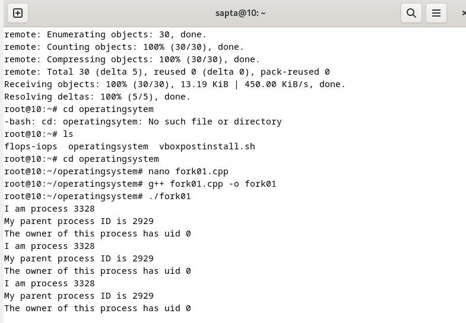
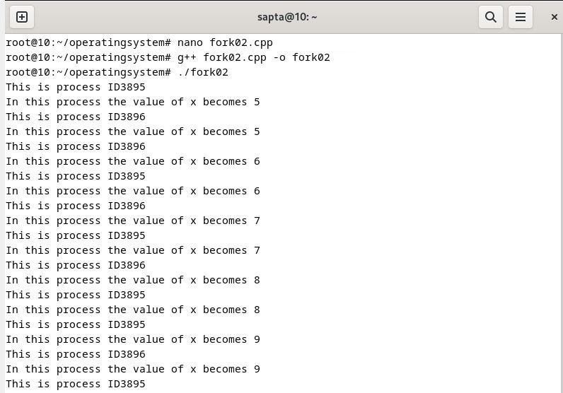
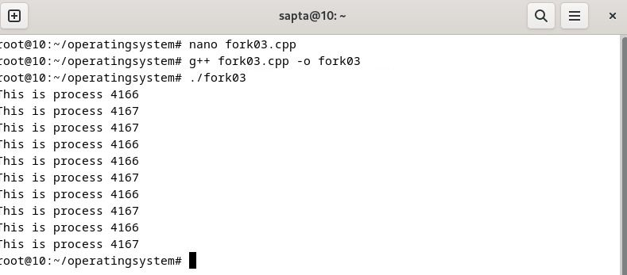

### NAMA : Sapta Adzani Purnama
### NRP : 3123521014
### Prodi : D3 Teknik Informatika-LA
### KELAS : A
## Fork : Parent - Child Process
### Buat tulisan tentang konsep fork dan implementasinya dengan menggunakan bahasa pemrograman C! (minimal 2 paragraf disertai dengan gambar)
### Akses dan clonning repo : https://github.com/ferryastika/operatingsystem.git
### Deskripsikan dan visualisasikan pohon proses hasil eksekusi dari kode program fork01.c, fork02.c, fork03.c
## cloning to (https://github.com/ferryastika/operatingsystem.git) :
#### melakukan cloning dengan perintah git clone kemudian masuk dalam direktori operatingsystem menggunakan perintah cd
.png>)

## instal gcc g++
#### sebelum menjalankan fork , lakukan instalasi compiler dengan cara masuk terlebih dahulu ke super user dengan mengetik perintah su - kemudian perintah instal dengan mengetikkan apt install gcc g++.perintah tersebut untuk menginstall compiler bahasa C dan bahasa C++
#### gcc adalah compiler untuk bahasa C dan g++ adalah compiler untuk bahasa C++
.png>)

## Fork 01
#### untuk menjalankan for01.cpp harus masuk ke direktori operatingsytem kemudian masukkan perintah nano fork01.cpp kemudian ketikkan perintah g++ fork01.cpp -o fork01.exe perintah tersebut digunakan untuk mengkompilasi program C++ yang disebut dengan fork01.cpp menggunakan compiler g++ dan menghasilkan output fork01.exe kemudian ketikkan ./fork01.exe untuk menjalankannya

### keterangan : Output program ini menampilkan PID, PPID, dan UID. Setiap kali program mencetak informasi, program akan berhenti selama 3 detik sebelum mencetak informasi lagi. Program ini melakukaan perulangan sebanyak 3 kali
#### isi fork01.cpp :
.png>)

## Fork 02
#### untuk menjalankan fork02.cpp dan fork03.cpp sama menggunakan cara seperti menjalankan fork01.cpp

### keterangan : Output dari program tersebut adalah menampilkan PID mereka sendiri dan nilai variabel x dalam loop tak terbatas. Program menggunakan system call fork() untuk membuat proses saat ini, dan menciptakan child process.untuk menghentikan gunakan ctrl+c.
#### isi fork02.cpp :
.png>)

## Fork 03
#### kemudian lanjut lagi

### keterangan : Output dari program tersebut adalah melakukan proses forking secara berulang yang menghasilakn proses baru dengan pesan yang mencatat PID masing-masing.
#### isi fork03.cpp :
.png>)

