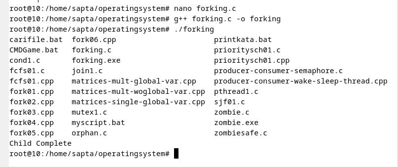
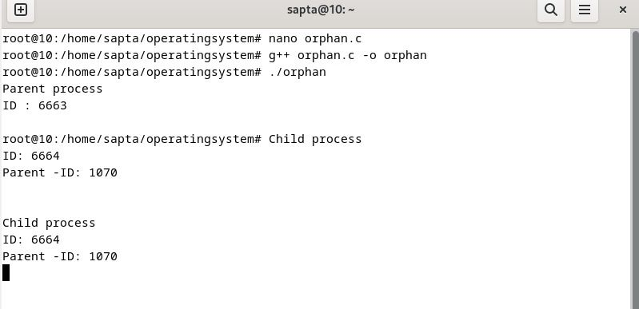
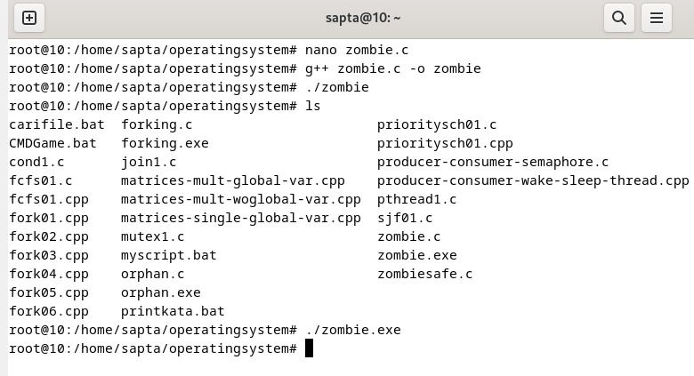

### NAMA : Sapta Adzani Purnama
### NRP : 3123521014
### Prodi : D3 Teknik Informatika-LA
### KELAS : A

## OPERATINGSYSTEM forking, orphan, zombie
### cloning to (https://github.com/ferryastika/operatingsystem.git) : melakukan cloning dengan perintah git clone karena saya sudah melakukan cloning dan direktori operatingsystem sudah ada maka langsung saja masuk ke direktorinya dengan perintah cd 

## forking
#### untuk menjalankan forking.c harus masuk ke direktori operatingsytem kemudian masukkan perintah nano forking.c untuk membuka file forking untuk keluar ketik ctrl+x kemudian ketikkan perintah g++ forking.c -o forking.exe perintah tersebut digunakan untuk mengkompilasi program C++ yang disebut dengan forking.c menggunakan compiler g++ dan menghasilkan output forking.exe kemudian ketikkan ./forking.exe untuk menjalankannya

### keterangan : setelah dijalankan forking.exe menampilkan semua file yang ada di direktori operatingsystem dan ada tambahan pesan child complete.
 #### isi forking.c :
 .png>)

 ## orphan
 #### untuk menjalankan orphan sama saja dengan menjalankan forking.c sebelumnya harus masuk masuk direktori operatingsystem dan menjalankan perintah nano orphan.c untuk melihat isi orphan.c kemudian perintah g++ orphan.c -o orphan.exe perintah tersebut digunakan untuk mengkompilasi program C++ yang disebut dengan orphan.c menggunakan compiler g++ dan menghasilkan output orphan.exe kemudian ketikkan ./orphan.exe untuk menjalankannya
 
 ### keterangan : setelah orphan.exe dijalankan output yang ditampikan id parent proses kemudian masuk ke perintah child proses secara otomatis dan menampilkan id dan pid dari child proses.
 #### isi orphan.c :
 .png>)

 ## zombie
 #### untuk menjalankan zombie sama saja dengan langkah" sebelumnya harus masuk masuk direktori operatingsystem dan menjalankan perintah nano zombie.c untuk melihat isi zombie.c kemudian perintah g++ zombie.c -o zombie.exe perintah tersebut digunakan untuk mengkompilasi program C++ yang disebut dengan zombie.c menggunakan compiler g++ dan menghasilkan output zombie.exe kemudian ketikkan ./zombie.exe untuk menjalankannya

 ### keterangan : Perintah ./zombie.exe akan menjalankan program yang ditulis di zombie.c. Program tersebut melakukan fork untuk membuat proses anak yang menjalankan perintah ls untuk menampilkan isi direktori saat ini.
 #### isi zombie.c :
 .png>)

